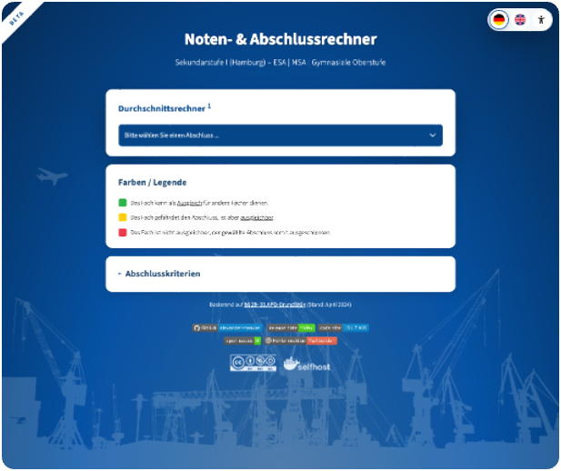

# Noten- & Abschlussrechner für die Sekundarstufe I (Stadtteilschulen in Hamburg)

**Webbasiertes Tool** zur Berechnung des **Notendurchschnitts** und einer **Abschlussprognose**
(ESA, eESA, MSA, SEK II) für die **Sekundarstufe I** (an Stadtteilschulen) in Hamburg.

Dieses Repository enthält eine statische Webanwendung (`HTML/JS/CSS`), mit der
Schülerinnen und Schüler ihre **E-/G-Noten** erfassen können. Das Tool läuft vollständig
lokal im Browser und überträgt keine Daten an externe Server.

<br>
<div align="center">

### **[▶ Programm direkt auf <u>GitHub Pages</u> nutzen ◀](https://alexander-henkes.github.io/noten-und-abschlussrechner-sek-i-hamburg/)**

<a href="https://alexander-henkes.github.io/noten-und-abschlussrechner-sek-i-hamburg/">
  
</a>

[](https://github.com/alexander-henkes)
[](https://alexander-henkes.github.io/noten-und-abschlussrechner-sek-i-hamburg/)
[](https://github.com/alexander-henkes/noten-und-abschlussrechner-sek-i-hamburg/releases/)
[](https://github.com/alexander-henkes/noten-und-abschlussrechner-sek-i-hamburg/releases)
[](https://github.com/alexander-henkes/noten-und-abschlussrechner-sek-i-hamburg)
[](https://github.com/alexander-henkes/noten-und-abschlussrechner-sek-i-hamburg/issues/)
[](mailto:github@alexander-henkes.8shield.net)

</div>

<br>

## Grundlage: APO-GrundStGy (04/2024)

Als Ausgangsgrundlage zwecks Noten- und Abschlussberechnung dienen die §§ 29-31 der hamburgischen [APO-GrundStGy](https://web.archive.org/web/20260120104037/https://www.hamburg.de/resource/blob/136184/0f0b5da5811d0277de8491e6de3acb42/apo-grundstgy-data.pdf) (Stand: April 2024). Die einzelnen, abschlussbezogenen Paragraphen sind hier einzusehen:

* [ESA](https://www.landesrecht-hamburg.de/bsha/document/jlr-Grd_StTSchulGymAPOHAV16P29) (Erster allgemeinbildender Schulabschluss – § 29)
* [eESA](https://www.landesrecht-hamburg.de/bsha/document/jlr-Grd_StTSchulGymAPOHAV6P29a) (erweiterter Erster allgemeinbildender Schulabschluss – § 29a)
* [MSA](https://www.landesrecht-hamburg.de/bsha/document/jlr-Grd_StTSchulGymAPOHAV16P30) (Mittlerer Schulabschluss – § 30)
* [SEK II](https://www.landesrecht-hamburg.de/bsha/document/jlr-Grd_StTSchulGymAPOHApP31) (Vorstufe der Gymnasialen Oberstufe – § 31)
 
Das Tool befindet sich in der <u>Testphase</u>.
<br>
<u>Angaben ohne Gewähr</u> – Verbindliche Auskünfte erteilen die Schulen!

## Funktionen

- **Abschlusswahl**: ESA, MSA oder Versetzung in die Sekundarstufe II.
- **Noteneingabe**: Fächerliste mit Pflichtfächern (D/M/E) und frei ergänzbaren Fächern.
- **Notenskala**: E1–E4 (erhöhtes Niveau) und G2–G6 (grundlgendes Nivveau).
- **Notendurchschnitt**: Berechnung und Ausgabe als E-/G-Note.
- **Prognose**: Ausgleichs- und Ausschlussregeln werden automatisch berücksichtigt.
- **Import/Export**: Noteneingaben als JSON speichern/herunterladen und hochladen.
- **Druckansicht**: Druckfähige Zusammenfassung der Noten und Prognose.
- **Sprachumschaltung**: Deutsch und Englisch.
- **Barrierefreier Modus**: Schwarz-Weiß-Layout mit reduzierten visuellen Effekten.

## Verzeichnisstruktur

```text
noten-und-abschlussrechner-sek-i-hamburg
├── .gitignore
├── .github
│   └── workflows
│       ├── broken-link-checker.yml
│       └── docker-publish.yml
├── assets
│   ├── documents
│   │   ├── anlagen
│   │   │   └── apo-grundstgy-hamburg-anlage-1.pdf
│   │   └── paragraphen
│   │       ├── apo-grundstgy-hamburg-§2.pdf
│   │       ├── apo-grundstgy-hamburg-§29.pdf
│   │       ├── apo-grundstgy-hamburg-§29a.pdf
│   │       ├── apo-grundstgy-hamburg-§30.pdf
│   │       └── apo-grundstgy-hamburg-§31.pdf
│   ├── fonts
│   │   ├── atkinson-hyperlegible
│   │   │   ├── OFL.txt
│   │   │   ├── atkinson-hyperlegible-bold-italic.ttf
│   │   │   ├── atkinson-hyperlegible-bold-italic.woff2
│   │   │   ├── atkinson-hyperlegible-bold.ttf
│   │   │   ├── atkinson-hyperlegible-bold.woff2
│   │   │   ├── atkinson-hyperlegible-italic.ttf
│   │   │   ├── atkinson-hyperlegible-italic.woff2
│   │   │   ├── atkinson-hyperlegible-regular.ttf
│   │   │   ├── atkinson-hyperlegible-regular.woff2
│   │   │   └── atkinson-hyperlegible.css
│   │   ├── open-dyslexic
│   │   │   ├── OFL.txt
│   │   │   ├── open-dyslexic-bold-italic.otf
│   │   │   ├── open-dyslexic-bold-italic.woff2
│   │   │   ├── open-dyslexic-bold.otf
│   │   │   ├── open-dyslexic-bold.woff2
│   │   │   ├── open-dyslexic-italic.otf
│   │   │   ├── open-dyslexic-italic.woff2
│   │   │   ├── open-dyslexic-regular.otf
│   │   │   └── open-dyslexic-regular.woff2
│   │   └── source-sans-3
│   │       ├── OFL.txt
│   │       ├── source-sans-3-variable.ttf
│   │       └── source-sans-3-variable.woff2
│   └── images
│       ├── background
│       │   ├── harbour.svg
│       │   ├── plane.svg
│       │   └── ship.svg
│       ├── badges
│       │   ├── a11yproject.svg
│       │   ├── cc-by-nc-sa.svg
│       │   └── selfhost.svg
│       ├── flags
│       │   ├── flag_a11y.svg
│       │   ├── flag_de.svg
│       │   └── flag_en.svg
│       └── screenshot.png
├── docker
│   ├── Dockerfile
│   └── docker-compose.yml
├── index.html
├── script.js
├── styles.css
├── README.md
└── LICENSE
```

## Installation

### Option 1: Online-Nutzung (empfohlen)

1. Rufen Sie den [Link zur Webanwendung](https://alexander-henkes.github.io/noten-und-abschlussrechner-sek-i-hamburg/) auf.
2. Das Tool wird vollständig in Ihren Browser geladen und funktioniert ab dann auch ohne Internetverbindung.

### Option 2: Lokale Nutzung

1. Laden Sie dieses Repository als ZIP-Datei herunter oder klonen Sie es:
   ```bash
   git clone https://github.com/alexander-henkes/noten-und-abschlussrechner-sek-i-hamburg.git
   ```
2. Öffnen Sie die Datei `index.html` in einem beliebigen Browser.

### Option 3: Docker-Container

1. Starten Sie den Container ([docker/docker-compose.yml](docker/docker-compose.yml)):
   ```bash
   docker compose -f docker/docker-compose.yml up -d
   ```
2. Öffnen Sie die Anwendung im Browser unter `http://localhost:8080`.

## Nutzung/Verwendung

1. **Abschluss:** Wählen Sie zuerst den angestrebten Abschluss.
2. **Noteneingabe:** Tragen Sie die Noten in den Fächern ein (Pflichtfächer zuerst).
3. **Abschlussprognose:** Prognose und Durchschnitt werden automatisch aktualisiert.

## Technische Details

- **Statisch**: Reines `HTML/JS/CSS`, ohne Backend-Komponenten.
- **Lokal & sicher**: Alle Berechnungen laufen im Browser.
- **Abhängigkeiten**: Keine externen JavaScript-Bibliotheken notwendig.
- **Schriftart**: Source Sans 3 als Variable Font lokal eingebunden (`assets/fonts/source-sans-3`, SIL OFL 1.1).

## Datenschutz

- **Kein Upload**: Es findet keine Datenübertragung zu einem Server statt.
- **Lokale Ausführung**: Der JavaScript-Code läuft ausschließlich auf Ihrem Endgerät.

## Lizenz

Dieses Projekt ist unter der **Creative Commons Attribution-NonCommercial-ShareAlike 4.0 (CC BY-NC-SA 4.0)** lizenziert.
Weitere Details finden Sie in der Datei [LICENSE](LICENSE).


### Was bedeutet das konkret?

✅ Sie dürfen dieses Tool nutzen, kopieren und anpassen, sofern **eine Namensnennung** erfolgt (Attribution) und **Weitergaben unter gleichen Bedingungen** erfolgen (ShareAlike).

❌ Die **kommerzielle Nutzung** ist ohne ausdrückliche Erlaubnis nicht gestattet!
